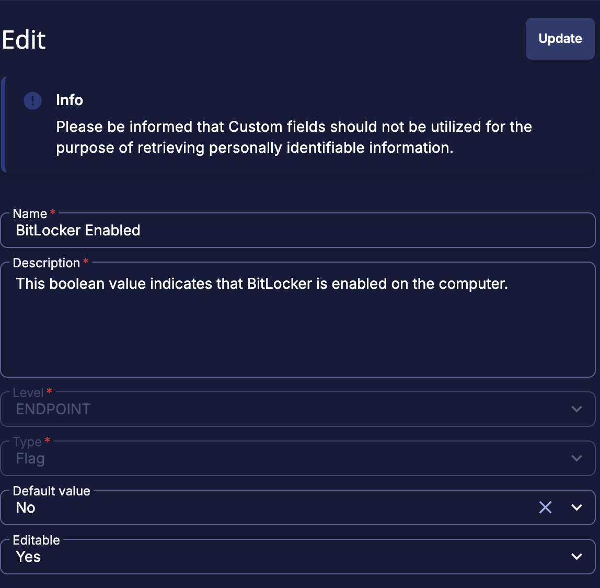

# Check if BitLocker Enabled


This script is designed for use with ConnectWise RMM. It determines whether any fixed drives on a Windows endpoint are encrypted with BitLocker and updates a custom field in RMM accordingly.

## How it works

1. Runs a PowerShell command to check BitLocker status on all fixed drives.
2. If any drive is fully encrypted, the script sets the custom field `BitLocker Enabled` to `true`.
3. Otherwise, it sets the field to `false`.

## RMM Integration

- **Custom Field:** `BitLocker Enabled` (Boolean or text field)
- **Output:** The script outputs the detected status (`true` or `false`) for RMM to consume.

## Setup Instructions

1. In ConnectWise RMM, create an endpoint-level custom field named **BitLocker Enabled** (Flag).

    

2. Add a new RMM Script component and paste in the following PowerShell script:

    ```powershell
    # Download + run the latest BitLocker check script IN-MEMORY, then echo only 1/0

    # Raw file URL (main branch)
    $Url = 'https://raw.githubusercontent.com/guiltykeyboard/MSP-Resources/main/ConnectWise-RMM-Asio/Scripts/Windows/checkIfBitlockerEnabled.ps1'

    # Ensure TLS 1.2 for GitHub
    try { [Net.ServicePointManager]::SecurityProtocol = [Net.SecurityProtocolType]::Tls12 } catch {}

    # Fetch script text (streamed, no local file)
    $scriptText = $null
    try { $scriptText = (Invoke-WebRequest -UseBasicParsing -Uri $Url -TimeoutSec 60).Content } catch {}
    if (-not $scriptText) {
      try {
        $wc = New-Object Net.WebClient
        $wc.Headers['User-Agent'] = 'RMM-Agent'
        $scriptText = $wc.DownloadString($Url)
      } catch {}
    }

    if (-not $scriptText) {
      # If we cannot download, emit a safe default for the field
      Write-Output 0
      exit 0
    }

    # Execute in memory; skip self-elevation with -NoElevate
    $scriptBlock = [ScriptBlock]::Create($scriptText)
    $rawOut = & $scriptBlock -NoElevate

    # Keep ONLY the 1/0 line for RMM parsing
    $val = ($rawOut | Where-Object { $_ -match '^[01]$' } | Select-Object -Last 1)
    if ($null -eq $val) { $val = ($rawOut | Select-Object -Last 1) }
    Write-Output $val
    ```

3. Configure the script step to update the **BitLocker Enabled** custom field with the `%output%` value.
4. Assign the script to devices where you want to monitor BitLocker encryption status.
5. Verify by running the script manually once and checking that the field updates correctly.

- **Custom Field Name:** `BitLocker Enabled`  
- **Custom Field Type:** Boolean (preferred) or Text  
- **Value:** `%output%`

## Notes

- Requires the endpoint to support BitLocker (Windows Pro/Enterprise SKUs).
- Windows 11 Home offers a basic "Device Encryption" feature on some hardware. This is not the same as full BitLocker, and this script will not detect or report on Device Encryption status.
- Run with administrative privileges for accurate results.
- This script does not back up recovery keys; see the `backupBitlockerKeys.ps1` documentation for key escrow and backup.
